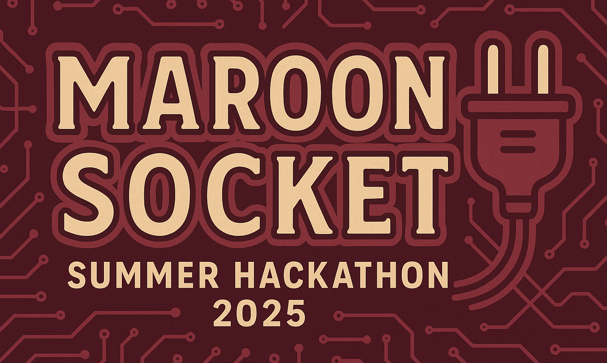

## Intro

Welcome to Plant Pal application repo. This is a full-stack web app that lets users add plants, set a reminder frequency and get notifications to water them. Notifications are sent via telegram. It also has a community section in which can create posts and add comments.

PlantPal was built over a span of 30 days for a Summer Hackathon by `maroon-socket`.

## Project Setup

<details>
<summary>🧩Tech Stack</summary>
<b>Frontend:</b> React, Tailwind<br>
<b>Backend:</b> Express, Zod, Prisma, Postgres & Supabase Bucket Storage<br>
<b>Notifications:</b> Telegram Bot API, Cron
</details>

<details>
<summary>🤖Reminder Bot setup</summary>
The app needs setting up a telegram bot to send notifications to the user.

To create a telegram bot you need to create a telegram accound and message the bot named `@Botfather`.

Type `/newbot` in its chat to start the process of creating a new bot and follow the instructions.

Sucessful creation of a bot will give you,

1. a token and,
2. a URL

The token will look something like this:
`4839XXX812:AAFD39kkdpWt3yXXXXXrgyOLMaJhac60qc`
Paste it in `.env` file within `server` folder with the key `TELEGRAM_BOT_TOKEN`.

The url will look something like this:
`t.me/plantpalremind_bot`. Add `?start=true` to the end and paste it in `.env` file within `client` folder.

Look at `.env.sample` for examples.

</details>

<details>
<summary>🚀 Steps to Run</summary>

1. **Clone the Repository:**

    ```bash
    git clone https://github.com/freeCodeCamp-2025-Summer-Hackathon/maroon-socket.git
    ```

2. **Install Dependencies:**

    ```bash
    npm install
    ```

### Running the backend

1. **Navigate to the Server Folder (Back End):**

    ```bash
    cd server
    ```

2. **Create a .env file:**

    ```bash
    cp .env.sample .env
    ```

3. **Setting up Supabase and Postgres**

    look at the [`server/docs`](https://github.com/freeCodeCamp-2025-Summer-Hackathon/maroon-socket/blob/main/server/docs/readme.md) for instructions on setting up supabase and postgres

4. **Start the Server:**

    ```bash
    npm run dev
    ```

    🔗 **Open your browser** at `http://localhost:3000` to see the server in action.

### Running the frontend

1.  **Navigate to the Client Folder(Front End):**

    ```bash
    cd client
    ```

2.  **Create a .env file:**

    ```bash
    cp .env.sample .env
    ```

3.  **Start the App:**

        ```bash
        npm run dev
        ```

        🔗 **Open your browser** at `http://localhost:5173` to see the client in action.

    </details>

## Project Team



1. Ayushi
2. Ganesh
3. Jait
4. Jayesh
5. Priyanka
6. Sam
7. Sanjana
8. Souptik
